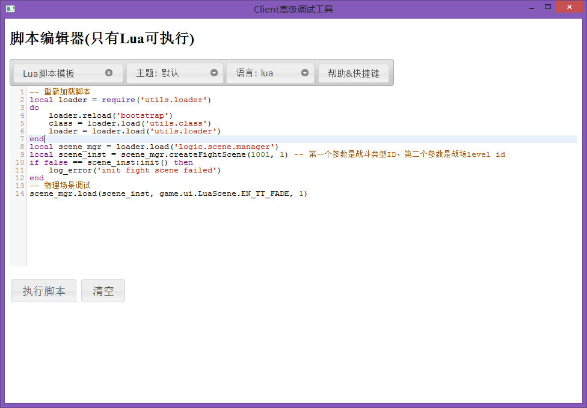

集成Qt Webkit 到cocos2d-x
============

[TOC]

前言
------
近期倒腾下客户端，想搞个cocos2d的工具。
之前的那个集成到Win32工具下的调试辅助工具是直接用的windows api。拓展起来巨麻烦。而且Windows默认的字符集是宽字符集，和cocos2d与lua交互起来得到utf-8之间转来转去，十分麻烦。所以干脆花点时间一口气搞完这货。

比起其他的工具来说，还是Qt简单些，而且还跨平台。不过这里基本只是Windows版的工具，但是为了扩展上的便捷，直接做成Webview是个不错的选择。所幸Qt里直接有Webkit组件，直接用就可以了。

初识Qt
------
我也是第一次接触Qt，之前一直是耳闻，没有用过。初次接触下来，感觉还是挺简单的。
记一下我碰到的几个问题。

1. Qt的主循环一定要放在主线程。放在子线程会导致消息不触发。
> 虽然我觉得不可理解，但是放在子线程会导致消息不触发。另外由于cocos2d并没有提供类似渲染一帧的接口，所以我不得不开辟多线程来解决这个问题。即：Qt主循环在主线程，cocos2d在子线程

2. Qt自定义了消息传递方式，**信号（SIGNAL）**和**槽（SLOT）**。
> 需要支持信号和槽的类需要在**.h**文件的声明中添加 *Q_OBJECT*。这里要注意必须是**.h**文件。放在.cpp里是不行滴。在申明信号和槽的时候，槽需要自己实现，信号的代码将会由Qt的*mocker*工具生成。
> Qt的工具做得还挺上流的。

3. Qt自己实现了一套对象管理模式，默认对象都会是全局的QApplication的子节点，删除父节点的时候子节点也会被删除。
> 这里还特别注意下和其他的对象管理方式混用的问题，之前我就因为用stl的shared_ptr管理自定义的对象，然后由于全局对象析构时不保证顺序的，所以有一定概率，在shared_ptr在QApplication后析构时会导致程序退出的时候崩溃

4. Qt绑定C++函数和对象到Webkit的方式也很简单，只要声明为Q_INVOKABLE即可。不过貌似提供的访问脚本层的接口功能不太强，不过已经够用了

导出接口和Webview
------

为了方便继承，可以把接口导出为C接口，然后再在C++里载入并追加回调，由于Webkit默认不允许主动打开本地磁盘文件，所以还另外增加了读取本地文件的接口。
```cpp
#ifdef _MSC_VER
#define DEBUGER_EXPORT __declspec(dllexport)
#define DEBUGER_IMPORT __declspec(dllimport)
#else
#define DEBUGER_EXPORT __attribute__((visibility("default")))
#define DEBUGER_IMPORT __attribute__((visibility("default")))
#endif

#pragma comment(lib, "debuger.lib")

extern "C" {
    typedef void(*debuger_js_fn)(const char **, size_t*, size_t, char**, size_t*);

    DEBUGER_IMPORT void debuger_init_app(int argc, char** argv);

    DEBUGER_IMPORT int debuger_exec(int(*fn)(int, char**), void(*exit_fn)());

    DEBUGER_IMPORT void debuger_exit(int code);

    DEBUGER_IMPORT void debuger_open_local_file(const char* path, size_t len);

    DEBUGER_IMPORT void debuger_open_url(const char* path, size_t len);

    DEBUGER_IMPORT void debuger_get_charset(char* name, size_t len);

    DEBUGER_IMPORT void debuger_set_charset(const char* name);

    DEBUGER_IMPORT void debuger_eval(const char* code, size_t len, char* ret, size_t* ret_len);

    DEBUGER_IMPORT void debuger_invoke(const char* name, debuger_js_fn fn);

    // 注册的回调函数
    static void debuger_invoke_run_code(const char ** argv, size_t* argv_len, size_t argc, char** ret, size_t* ret_len) {
        if (argc < 2) {
            cocos2d::log("run lua code require 2 parameters.");
            return;
        }

        std::string code(argv[1], argv_len[1]);
        code.push_back('\0');
        script::lua::LuaEngine::Instance()->addPendingCode(code);
    }
}

    // 初始化注册
    void CommandWindow::init(int argc, char** argv) {
        cmd_argc_ = argc;
        cmd_argv_ = argv;

        // 初始化
        debuger_init_app(cmd_argc_, cmd_argv_);
        // 打开本地web页
        debuger_open_local_file("../proj.win32/debuger.webview/index.html", 0);
        // debuger_open_url("http://www.baidu.com", 0);

        // 函数注入
        debuger_invoke("run_code", debuger_invoke_run_code);
    }
```
再把一个web组件导进来，就完工了。我边导入了jQuery、jQuery UI和codemirror。
**唯一要注意**的是由于Qt线程和cocos2d处于不同线程下，注意下多线程安全就可以了

搞定收工
------
这么一来可以写Web页来做客户端工具，比用C++方便多了。
效果如下: 


点击**“执行脚本”**就会执行上面注入的*debuger_invoke_run_code*函数。很Nice吧。

所有代码托管在：https://github.com/owt5008137/client-debuger
有兴趣的童鞋可自取

> Written with [StackEdit](https://stackedit.io/).
