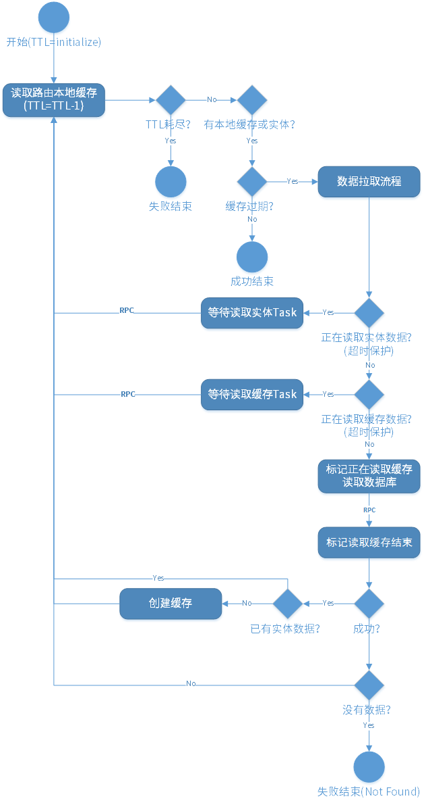
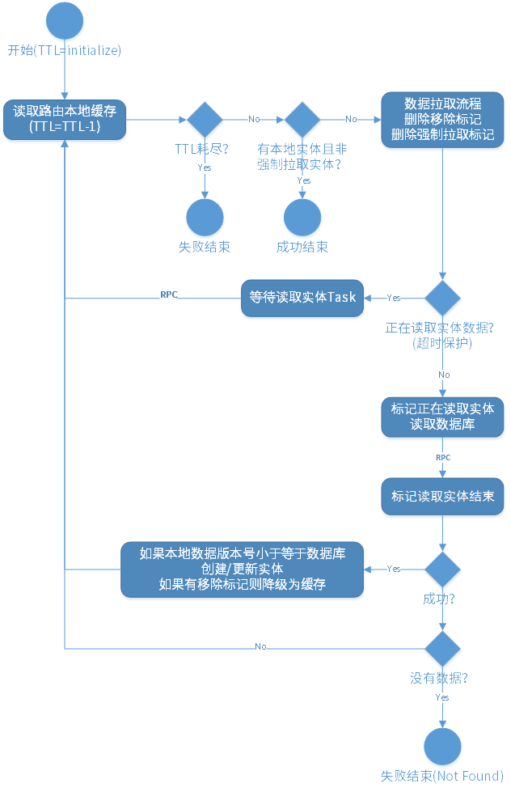
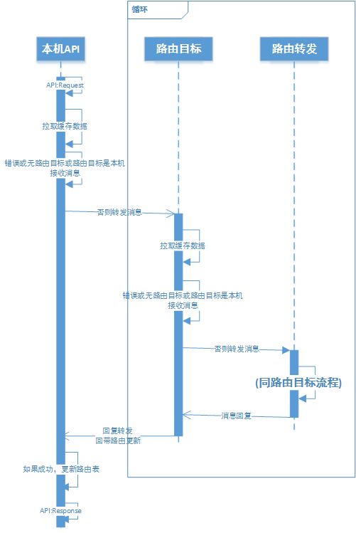

# 对象路由系统设计

<!-- toc -->

## 起源

现在的手游也开始越来越复杂，以前少量交互线上保存的服务器架构越来越不能满足现在越来越偏向PC端MMORPG的需求。比如现在手游也引入了地图服务、公会服务等等。特别是地图服务需要能够动态切换服务节点、并且由于广播量巨大，导致我们得用更多级的缓存和更复杂的负载均衡。这些缓存和负载均衡都会涉及缓存失效、同步、更新、发现延迟等问题，所以越来越需要一个路由系统来解决这些问题。

那么为什么不用kafka之类成熟的消息分发系统呢？其实是我没找到成熟的特别适合游戏的路由系统。比如kafka虽然很强大，但是不适合太多topic，但是游戏中的路由要以玩家或工会或某个逻辑实体为单位，会导致有海量的topic。

一般MMO都会设计一套合适的消息路由来完成这件事，但是这对手游的成本还是有点偏高。因为这会多一组服务器会专门维护不同类型的路由消息，并且不同服务器要分别有订阅、回发分类功能，还要做容灾，比较复杂。所以时间工期的原因，我这里就设计了一套对象路由系统。这样很多想类似的功能可以复用同一份代码实现，并且和项目中的对象类型关系比较紧密，试用上也方便一些。

当然如果说时间和人力足够，还是专门的消息路由系统比较好。毕竟消息路由系统更严谨、接口一致、通用性也更高。并且由于隔离度更高，所以对使用者来说，坑会少非常多，并且和本身业务逻辑的互相影响会笑很多。简单得说，消息路由系统其实比我这个对象路由在接口隔离、依赖反转、单一职责方面会做得更好。

## 对象路由的实现

### 基础定义

首先要有两个名词定义：

1. **缓存**：指的是路由系统中的数据对象为缓存，这时候并不是时时数据，但会定期更新。缓存数据是只读的（除了一些特殊的同步流程）
2. **实体**：指的是路由系统中的数据对象标记当前进程为实时数据的操作者，这时候数据可写，而且一个实体数据同时只能在一个进程上。
3. **逻辑对象**: 每个路由系统中的数据类型都会对应一个立即对象，包含着这种数据的逻辑索引、逻辑功能和对数据的重组织。
4. **路由ID:** 路由实体对象所在的进程ID

由于协程的存在，大幅简化了对象路由系统巨复杂的数据透传问题和RPC组合的问题。因为对外暴露的借口是很简单的，就是查询和移除缓存或者实体。但是实际执行过程中会根据当前是否有缓存，是否是实体，缓存是否过期等等执行不同的拉取、初始化流程。这其中还会有一些错误容忍，并重试（当然如果不存在就不需要重试）的过程。这些流程有很多步骤是异步的，再加上一些等待数据的排队功能，非常复杂。协程最大化简化了这些恶心的流程的数据透传和回调，使得每个功能块都只关注自己的那一部分，不用关注多个RPC功能组合带来的复杂度。

### 实现

**首先要定义路由对象和路由对象模板**，有一些共通的操作是给予类型的，所以要用模板。路由基类定义必须要实现的接口和路由信息的维护功能和一些时间和状态管理即可。具体接口下面有写。

**然后要定义管理器和管理器模板**，管理器要保存数据和索引，所以必然是基于类型的。然后有一些通用操作也在这里面完成，比如路由转移的操作、缓存升级实体的时候的数据重拉取和flag标记、降级的时候的数据保存、统一的索引管理等等。

**再就是定义管理器集合管理器**，统一定时器的管理，主要是定时降级、淘汰和触发数据保存。这样统一到一个单例中。这样不用每个manager里都实现一遍。另外还可以把原本游戏服务器中单独处理的缓存和超时管理直接利用这个管理器的定时系统保存。比如我把我们队玩家的定时保存和玩家和Session的绑定关系就移到了这里。

接下来就是路由系统的逻辑部分，先是要**定义路由和路由版本控制**，记录每个路由缓存它的实体在哪里和版本。版本主要是用于后面的路由刷新和缓存的。

以上是大致的路由缓存拉取时序图（图画得比较早，细节不准确，只表示大概的流程）:

以上是大致的实体拉取时序图（图画得比较早，细节不准确，只表示大概的流程）:

最重要的路由系统写逻辑是**定义路由转移流程**。大致如下：

1. 当然转移前要先把路由ID设为0，并保存一次数据。并把本地实体降级为缓存。

   > 这里数据库保存可能失败，但是无论是否数据库保存成功，都应该降级为缓存，并且先执行降级，再执行保存。这里有两种容灾的情况，第一种是保存成功了但是本地超时或者出错，那么下一次操作拉取实体的时候会自然修复。另一种是真的保存失败，那么下一次拉取实体的时候会发现数据库中的路由版本号低于或等于本地，从而依然使用本地的数据，但是重新刷新路由ID。

2. 然后通知转移目标执行拉取实体的操作。

3. 等对方回复后继续本地操作

4. 路由转移的过程中所有该对象的消息要进排队，结束后再转发（保证逻辑时序）

以上是大致的路由转移时序图（图画得比较早，细节不准确，只表示大概的流程）:

路由系统的读逻辑是**定义消息路由流程**。即，发送路由消息时发给路由缓存中记录的路由ID。如果路由ID是自己，那就是发消息给自己。

而对于接收端，要**定义消息接收流程**。收到路由消息后第一步***可能***导致本地进程按类型和Key去拉取路由实体，如果发现缓存的路由目标地址不是自己，则再转发给自己记录的缓存路由ID。***转发前检查TTL，以免导致逻辑死循环***。时序大致如下（图画得比较早，细节不准确，只表示大概的流程）:

这里发生路由ID不一致时，粗略上看有两种情况，第一种是来源版本号大于或等于本地，这时候因为如果本地记录的路由ID不是自己，则本地不是实体，那么收到路由消息后要***触发本地进程拉取实体的操作***，这时会拿到最新的路由版本号。这个版本号必然是最新的，不会低于任何一个缓存。 

另一种就是来源版本号低于本地，那就是来源进程的缓存过期了，那么这里要**定义路由刷新流程**。即直接通知来源本地的版本号和路由ID。这种情况下本地的路由ID也并不一定是最新的。

> 比如A转移给B，B转移给C，那么这时候A里记录的还是B。这时候如果有过期的D发消息给A，那么A通知D的是B而不是C。

这时收到路由刷新的进程就要判定刷新通知的版本号和本地版本号，然后***刷新通知的路由版本号大于本地时才更新路由信息***。这样，最后所有的进程总能更新到最新的路由，并且能避免转移实体时集中的通知操作和通知失败的处理。

### 使用约定（手动部分）

+ （必须）按类型区分，路由Key的类型固定（一个string+一个int64）

+ （必须）每种路由对象类型必须指定一个逻辑对象类型

+ （必须）实现实体拉取方法和缓存拉取方法

+ （必须）路由位置（拥有者的ID）必须是ID+版本号的组合

+ （必须）拉取实体和缓存时必须设置路由数据中记录的实体所在进程ID和版本号。

  > 如果拉取实体的时候路由ID是0，则要把本地的进程ID保存进实体数据中，并且成功后才真正转为实体

+ （必须）实现实体的保存方法，而且保存过程中绝不能刷新对逻辑对象数据的引用

+ （必须）保存实体的时候，必须保存进程ID和版本号，如果逻辑对象中也有记录这些信息，要保证数据一致

+ （必须）转移实体的时候必须版本号+1，并且要支持转移给0进程（表示不在任何进程上）

+ （必须）一定要支持reload，因为每次缓存更新和缓存升级为实体都会触发reload

+ （必须）每种对象类型要同时定义manager的类型和对象路由类型，并定义manager的ID

+ （必须）每种对象类型拉取数据的时候，当且仅当远端的路由版本号大于本地时才刷新数据**（等于时也不能刷新）**

+ （可选）根据类型指定实体拉取管理规则（比如公会实体只能在公会服务器，其他地方都是缓存）

+ （可选）区分缓存拉取和实体数据拉取

+ （可选）定义拉取和移除缓存或实体的回调

也是因为使用约定非常多，也容易出错，而且并没有很好的编程语言级别的功能能完全校验这些约定，特别是缓存的只读特性只能人工保证，这些直接导致了接入的复杂度。这也是直接导致隔离性没有消息路由系统好的原因。

### 统一接口（自动部分）

+ **能够自动完成长时间不使用的实体对象的降级（到缓存）**
+ **能够自动完成长时间不使用的缓存对象的淘汰**
+ 自动完成最后使用时间的标记
+ 自动执行缓存的定时更新
+ **路由消息转发接口**
+ **多个任务同时拉取缓存或实体时的任务排队**
+ **路由层协议嵌入到Server间消息协议中和自动的路由消息数据填充**
+ **进入路由任务时自动拉取路由实体**

加粗的都是复杂并且麻烦的流程。

## 和消息路由服务对比

| 比较项   | 对象路由 | 消息路由服务 |
| ----- | ---- | ------ |
| 运维难度  | 简单   | 复杂     |
| 接入复杂度 | 复杂   | 简单     |
| 代码复用  | 高    | 低      |

上面是一个简单的对比，消息路由运维复杂是因为需要单独维护一组服务器的负载均衡、容灾、扩缩容策略和缓存处理等等。基本上是一个独立的服务集群，所以比较复杂。

而对象路由代码复用度高是因为很多地方和逻辑相关，所以可以复用很多共通的逻辑，比如生命周期和定时器、超时、重试、重试限制和错误处理等等。并且可以复用已有的消息协议结构，做到透明转发。还可以复用目前已有的日志系统、统计系统和分析系统。

但是也是由于路由系统的复杂性导致上面列举的约定条目很多，容易出错或遗漏，而导致每一种路由对象的接入都十分复杂。而且不同类型的路由对象本身有一些规则上的区别。而如果是消息路由服务，则只需要通过几个简单的接口进行订阅、发布和反订阅即可。并且要求订阅者是唯一的，所以再加个心跳检查订阅者是否还有效即可。

当然如果是消息路由服务，由于逻辑隔离了，所以整个数据的流程会更复杂。因为在对象路由中，有一些行为可以合并并且更优化地执行（比如路由刷新的流程）。

## 写在最后

这一套对象路由系统比较复杂，或许以上设计中也还存在着一些问题，欢迎大家指出讨论。即便没有严重的问题，目前的版本的代码实现必然还存在很多细节问题。等到验证过一些系统和模块并且稳定之后，我会尝试把它抽离并开源出来。这样容易在更多的项目上复用，并进一步完善细节和稳定性。

